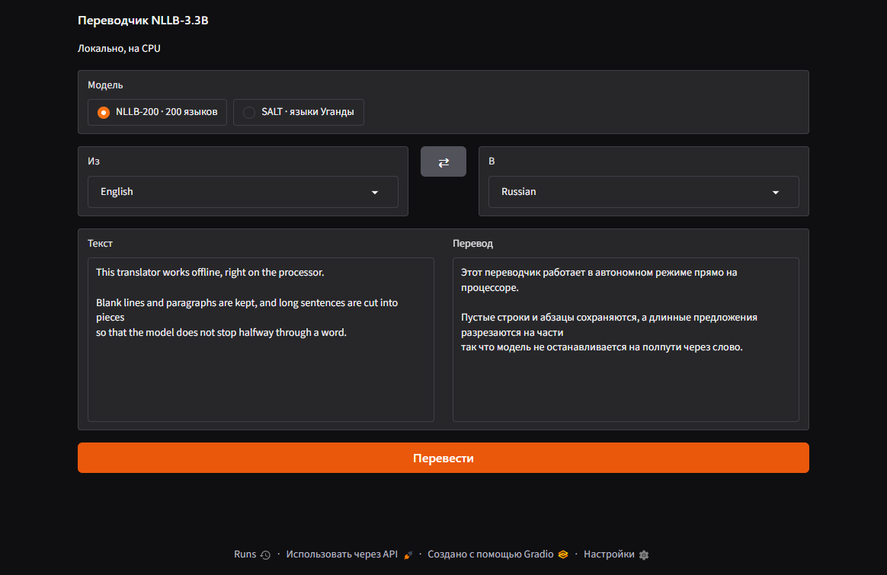

<div align="center">

# Translator AI

**A local translator on the NLLB-3.3B neural network: offline, on the CPU, 202 languages plus the languages of Uganda. The code is MIT; the models are CC BY-NC 4.0 and are not part of this repository.**

[Download for Windows](https://github.com/ALEXalesha/SaltTranslator/releases/latest) &nbsp;·&nbsp; [Русская версия этого файла](README.ru.md)

[](https://github.com/ALEXalesha/SaltTranslator/actions/workflows/ci.yml)
[](https://github.com/ALEXalesha/SaltTranslator/releases/latest)
[](LICENSE)
[](#models-and-licences)



</div>

> **The interface is in Russian**, and so is the long write-up, [README.ru.md](README.ru.md), which this file summarises. «Модель» is the model, «Из» and «В» are the source and target languages, «Перевести» translates.

## Two models, one switch

| Model | Languages | Size | For |
|---|---|---|---|
| **NLLB-200** (Meta, int8 build by OpenNMT) | 202 | 3.4 GB | an ordinary translator: Russian, English, Turkish and two hundred more |
| **SALT** (Sunbird AI, fine-tuned NLLB) | 9 | 3.2 GB | the languages of Uganda: Luganda, Acholi, Lusoga, Rutooro and others |

## Installing

The window opens where and how large it was closed (since 1.1.0); the saved place is checked against the monitors present, and a window from an unplugged monitor opens centred on the main one.

The installer and the portable exe weigh about 230 MB: Electron and Python with every package are inside, the models are not. On first start a window offers to:

- download NLLB-200 (3.4 GB) from Hugging Face, resuming after a dropped connection and checking SHA-256; a "download around the VPN" box sends the download through the ordinary network card, because Hugging Face over some VPN tunnels crawls at 20-150 KB/s;
- or point to a folder where the models already are.

SALT cannot be downloaded: no ready int8 build of it exists. README.ru.md explains how to convert it; it is picked up when the chosen folder contains `ct2-int8`.

## What happens to the text

Text is split into sentences, and long sentences into pieces of up to 120 tokens: at 200 tokens NLLB stops mid-word, and towards a thousand it starts repeating one word. Pieces without letters ("...", "3.14", emoji) go around the model, which otherwise invents words for them. Blank lines, indentation and paragraphs are kept; Chinese and Japanese sentences are joined without spaces. `⇄` swaps the languages, and the texts only if there is already a translation.

The screenshot shows the price of keeping the layout: a sentence broken by a line break is translated as two pieces, because every line stays a line. A long sentence without line breaks is cut by tokens and glued back without such seams.

## Tests

```powershell
.venv\Scripts\python.exe -m pytest     # 61 fast tests, about a minute
.venv\Scripts\python.exe -m pytest -m slow   # 3 on the real NLLB, about six minutes
cd electron; npm test                  # 37: downloader, paths, starting Python
```

The translation core (`core.py`) is checked with **Hypothesis** properties: no piece sent to the model exceeds the token limit; no character is lost or duplicated by the splitting; the number of lines, blank lines and indentation survive any line endings (`\n`, `\r\n`, `\r`); the model is called at most once per request and never sees pieces without letters; language service tokens never leak into the text; `⇄` never loses what you typed; an unknown language gives a clear error, not a crash. A `huge` profile runs 20 000 examples per property.

The slow tests run the real model on random texts in four languages and check that a long text with no full stops and a long Chinese paragraph are not truncated. The Node tests start a local HTTP server and check resuming, a server without Range support, a dropped connection, a wrong SHA-256, redirects and cancelling.

## Running from source

```powershell
uv venv .venv --python 3.13
uv pip install --python .venv\Scripts\python.exe -r requirements.txt
run.bat
```

The models have to be put into `models\` first; README.ru.md has the exact download commands and checksums.

## Screenshots are generated

`electron/tools/make-screenshots.js` starts the real backend the way the app does, types a text, presses Translate and captures the page after a real translation by the model, with `capturePage()`, so no other window can get into the frame. There are no models in the repository, so without them the script fails honestly.

## Models and licences

**The code** in this repository is MIT, see [LICENSE](LICENSE).

**The models are not.** Their authors distribute both under [CC BY-NC 4.0](https://creativecommons.org/licenses/by-nc/4.0/): you may use and adapt them, **not for commercial purposes**, with attribution.

| Model | Author | Model card |
|---|---|---|
| NLLB-200 3.3B, CTranslate2 int8 build | Meta AI; conversion by OpenNMT | [OpenNMT/nllb-200-3.3B-ct2-int8](https://huggingface.co/OpenNMT/nllb-200-3.3B-ct2-int8) |
| SALT (NLLB fine-tuned on the languages of Uganda) | Sunbird AI | [Sunbird/translate-nllb-3.3b-salt](https://huggingface.co/Sunbird/translate-nllb-3.3b-salt) |

The model weights are **in neither this repository nor the releases**. NLLB-200 is downloaded from Hugging Face by the app itself; SALT is converted by the user. The MIT licence on the code does not change the terms of the models.
